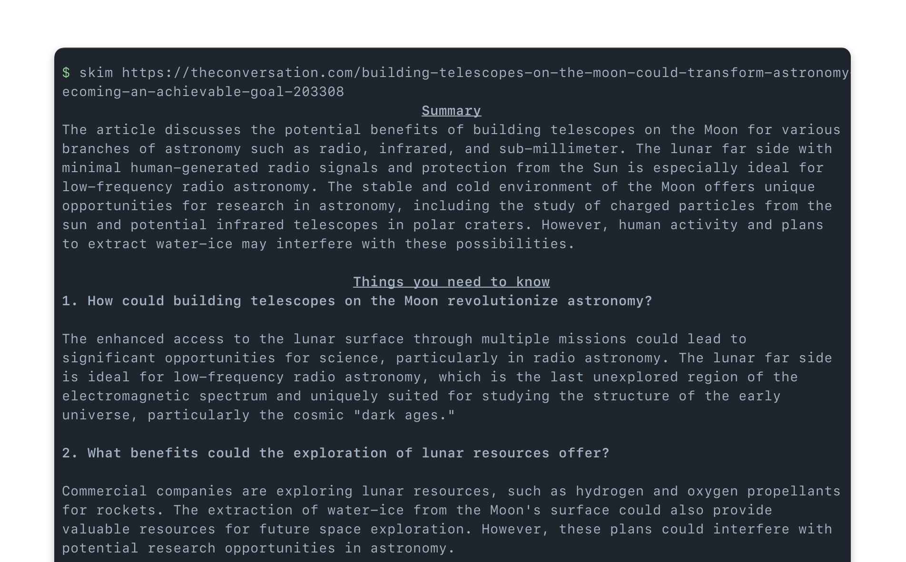
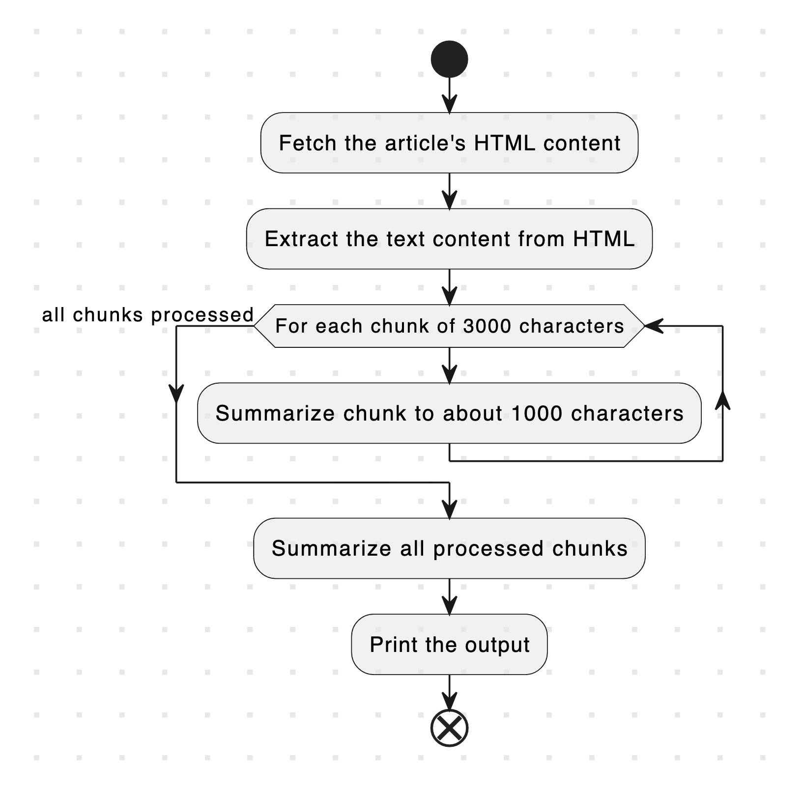

# SkimGPT

When you're too lazy to either read the article or ask AI questions, you can use SkimGPT to help you.



## Install

Clone this repo:

```bash
git clone https://github.com/huytd/skimgpt
```

And run the following commands:

```
cargo install --path .
```

Oh, make sure you have Rust in your computer.

## Usage

After install, you can use SkimGPT with the `skim` command:

```bash
skim <article URL>

# for example

skim https://notes.huy.rocks/posts/rust-for-the-web.html
```

## How does this works?

This is my attempt to try out a couple of things with OpenAI API:

- Recursive Summarization to overcome GPT3.5's 4k tokens limit
- Single shot prompt to generate the output in my desired format

To do so, we first fetch the article's HTML content, split them into chunks of 3000 characters. Then, for each chunk, call the GPT3 API to generate a summary.

Finally, accumulate all the summaries from all the chunks, and feed it to GPT3 API again to get the final summary, as well as generate a few questions and answers about the article.


